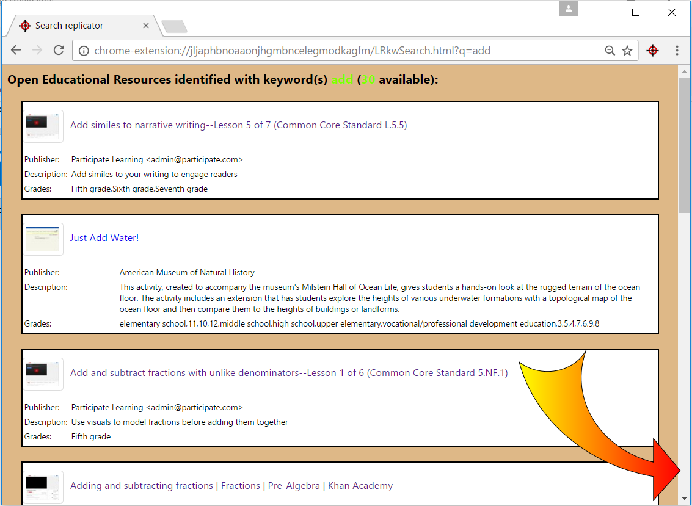
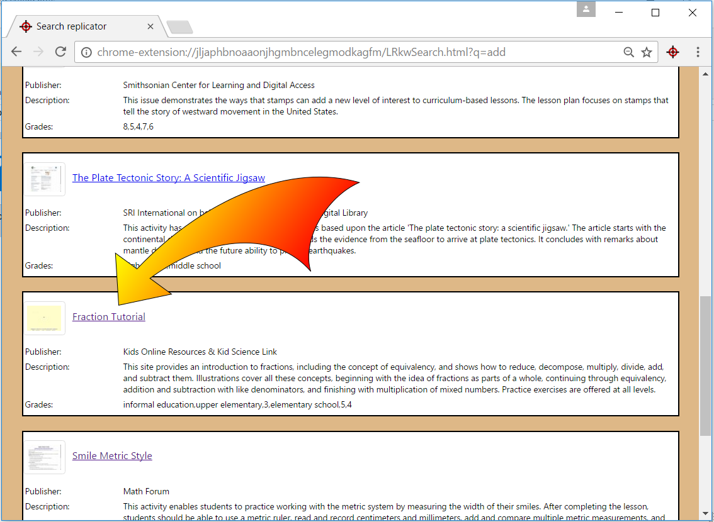
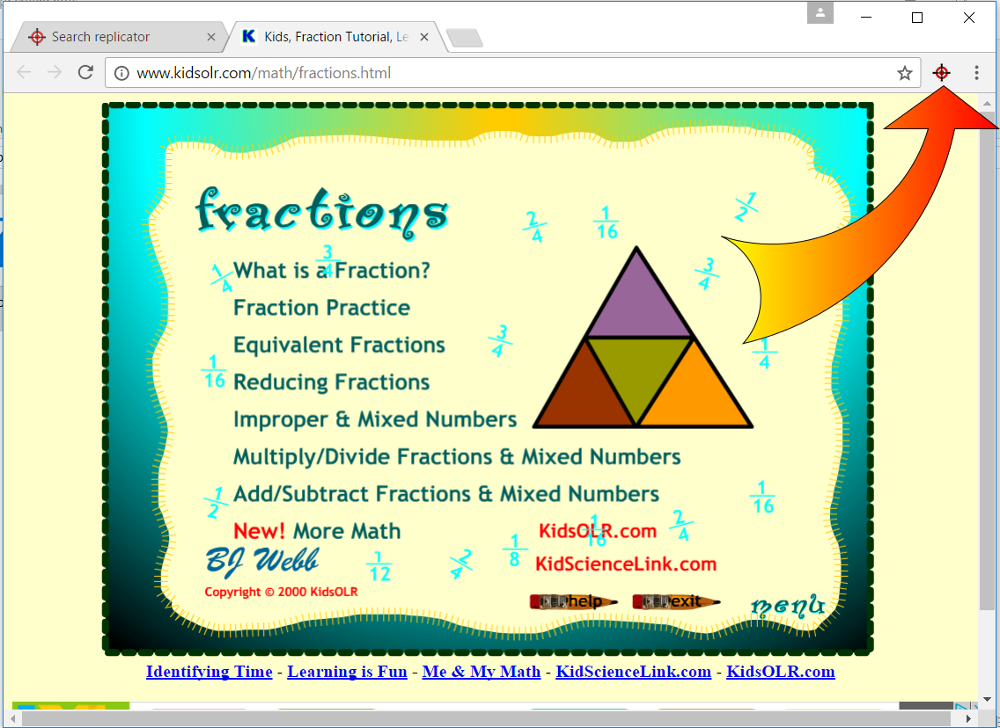
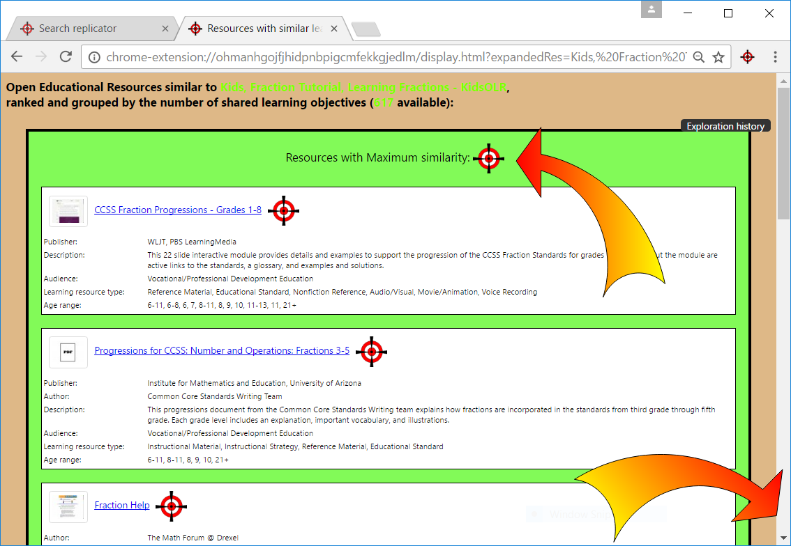
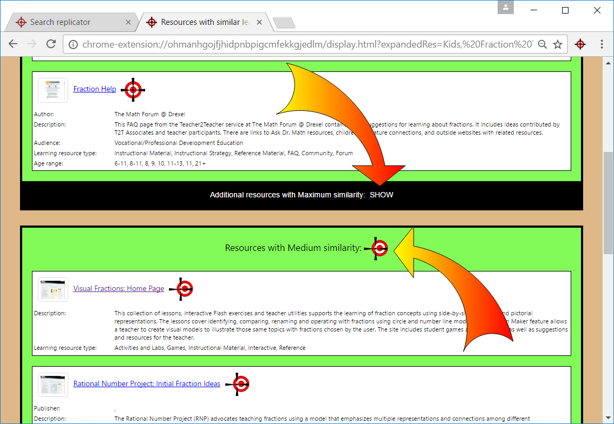
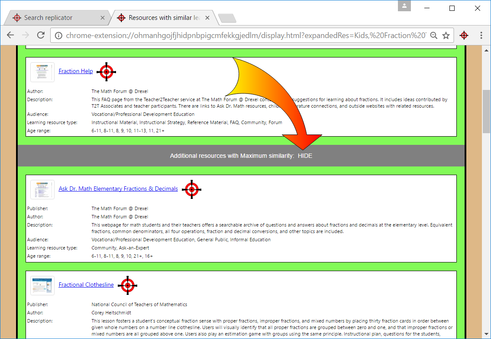
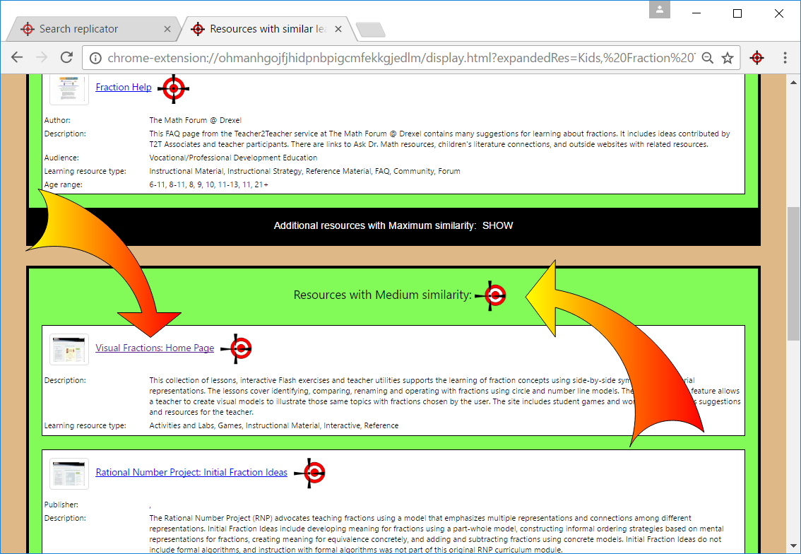
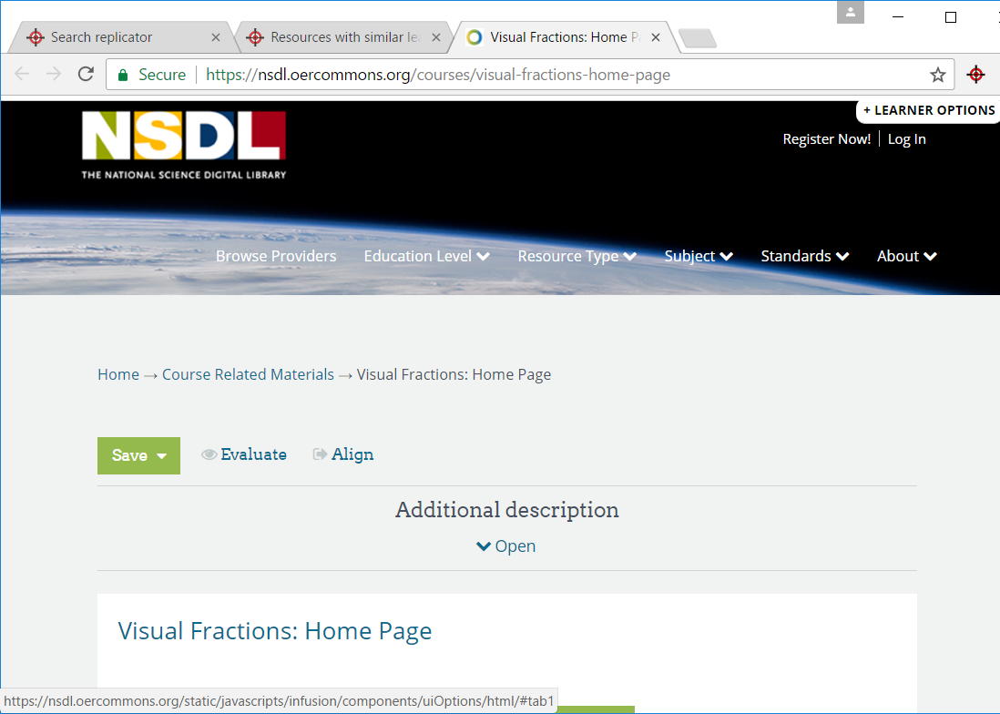
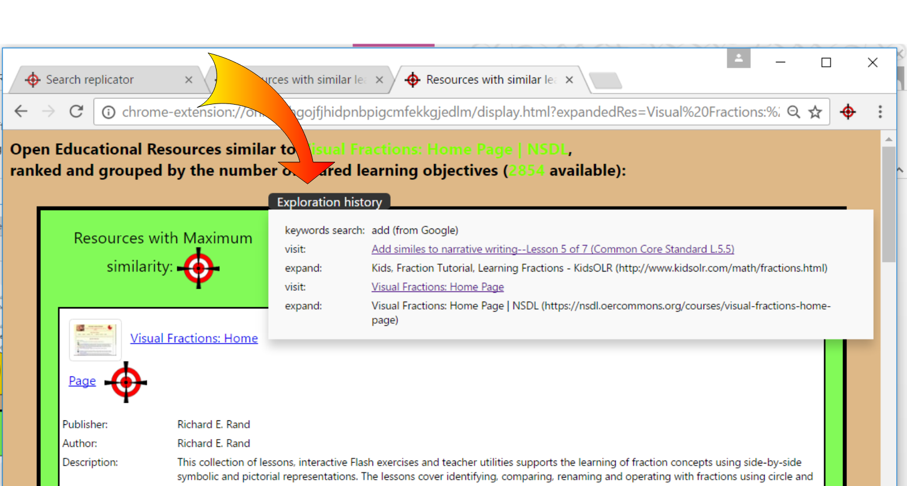

# **Discoverer**

Discoverer is a prototype supporting the **discovery of educational resources**, implemented as a Chrome™ browser extension.

* When activated from a Google™ results page (SERP), Discoverer intercepts the user search keywords and transparently replicates the search in a large hub of educational resources, producing a custom SERP with plenty of educational resources and related (LRMI) educational metadata. 
 
* When activated while examining an educational resource, Discoverer identifies, with a Query By Examples approach, additional similar resources. Identified resources are “***similar***” according to a strongly domain-oriented similarity metric defined in this project as the number of shared alignments to educational standards (practically, at the moment,learning objectives).

---

The system makes transparent use of (sometimes large numbers of) standard alignments without the need for users to be aware of them. 
* This makes it possible, among other advantages, to reuse the considerable efforts in aligning resources to educational standards, high-quality crowdsourced curated data, in Countries where formal educational standards are not used.
* However, this strongly domain-oriented feature is equally important in Countries where educational standards are formally used: here educators are naturally inclined to consider two resources similar, more because they have similar learning objectives, rather than just because they happen to share some words.

---

Finally, as the system tends to produce a large amount of excessively similar resources, results are clustered in expandable groups of comparable similarity, and just a few representatives for each cluster are presented to users:
* This helps to provide users with a more comprehensive and representative picture of the whole (potentially large) result-set: a compressed view, or expandable overview, of the resources.
* Additionally, this is a strongly domain oriented feature that supports educators in their high-level tasks, that is finding resources for specific educational needs. For example, a high degree of similarity (in terms of learning objectives) is desirable between a resource used in the main classroom activity and a resource to be used in a remediation activity. Yet, a lower degree of similarity, that is a more limited overlap of learning objectives, would be preferable in case the resource was to be used for in-depth activities, in order to offer students the opportunity to face new challenges.

## Where Discoverer comes from
Discoverer represents the evolution of previous prototypes, following their evaluation with experienced educators from different Countries, in the context of a rigorous Design Science Research methodology.

* [Injector](https://github.com/renatomario/ERD/blob/master/README.md), an early prototype, identified educational resources within Google™ SERPs, where it injected custom-rich-snippets containing “transparent” expansion functionalities to (or suggestions for) “similar” resources, in addition to LRMI metadata. While that prototype was considered very useful as a proof of concept, it suffered from the limited number of educational resources that could be identified within Google™ SERPs (intrinsic sparsity), and the limited resources that could be expanded (metadata sparsity).

* [RepExp](https://github.com/renatomario/RepExp/blob/master/README.md) was a new prototype that solved the problem of sparsity previously identified, by transparently replicating a Google™ search in a large hub of educational resources, and offering again educational metadata and expansion functionalities to similar resources. Yet, in that case, educators were overwhelmed by the large amount of results, and concerned about the excessive similarity of the resources identified.

## Commented screenshots

This section illustrates a sample search/discovery session actually carried out with the prototype, with a commented sequence of screenshots. The next screenshot shows the traditional SERP returned by Google™ following a search with the keyword “add”. The keyword is intentionally pretty imprecise, so that the SERP includes entries concerning Attention Deficit Disorder, and the brand “add” selling down jackets collections, as well as entries related to the mathematical operation addition:
 

Unsatisfied by the results, the user decides to initiate a discovery exploratory activity by clicking on the Discoverer icon on the top right of the screen (arrow in the previous screenshot). Discoverer detects that it has been called from the context of a Google™ SERP, hence it intercepts the keyword or keywords used in the previous search (just “add” in this case), replicates the query in a specialized hub of educational resources (the Learning Registry), and displays the new resulting custom SERP as in the following screenshot. The keyword “add” is pretty imprecise, however the search has identified 30 related educational resources, displayed in the SERP with related educational metadata:

The user scrolls down the list obtaining the next screenshot, and being interested about adding fractions, he/she clicks on the potentially useful resource “Fraction Tutorial” to explore it:

The educational resource is displayed in a new tab, as shown below, so that the user can freely explore it:

The user is now interested in getting additional resources similar to this one, so that he/she clicks on the Discoverer’s icon again. This time, Discoverer detects that it has not been called from a Google™ SERP, therefore it intercepts the current URL, assuming that it is the identifier of an educational resource. Then, it attempts to identify its educational alignments, searches for additional resources sharing some of its educational alignments, ranks and clusters them by degree of similarity, and creates and displays the following SERP page:
 

The above page indicates that 617 similar resources have been identified, and shows the first few ones having maximum similarity; the snippets displayed for each resource contain a rich set of educational metadata such as, in this case, Publisher, Author, Description, Audience, Learning Resource Type, and Age Range.

By scrolling down the window, it is possible (next screenshot) to see another cluster of resources, this time with medium degree of similarity. Scrolling further down would show a third cluster containing resources with minimum similarity. Discoverer only shows a few sample resources for each cluster, but the user can get more by clicking on the corresponding button. For example, the user in the next screenshot requests more resources with high degree of similarity, by clicking on the corresponding "SHOW" button:

 
obtaining:
 

Here, the user decides to hide again the additional resources with maximum similarity, by clicking on the corresponding "HIDE" button.

The user now decides to explore one of the listed resources having medium similarity, perhaps because he/she is interested in obtaining an additional educational resource, to be used for in-depth activities, hence not too similar to the previous one. Hence he/she clicks on its title, to get access to the resource:

obtaining:

From here it is possible to request again new similar resources, in this case 2854 (next screenshot), always ranked and clustered according to their degree of similarity.
It is important to note that such an expansion could be triggered from any resource, found in any possible way, not just via Discoverer; as an example, an educator might start directly from a resource he/she is already using in the classroom, and easily find other very similar resources for remediation activities, or less similar resources for in depth activities.
 
 similar resources, again ranked and clustered by degree of similarity.")

Finally, at any time, the user can display his/her navigation history:

---
---

## Feedback
Main objective of this prototype is to share ideas being developed in a research project, investigating solutions to support the discoverability of (open) educational resources: any feedback is definitely welcome!

## Acknowledgments
The development of RepExp has been possible thanks to the *multi-faceted openness* of the [Learning Registry](http://learningregistry.org): openness of **metadata**, and openness of their powerful REST **services**.

